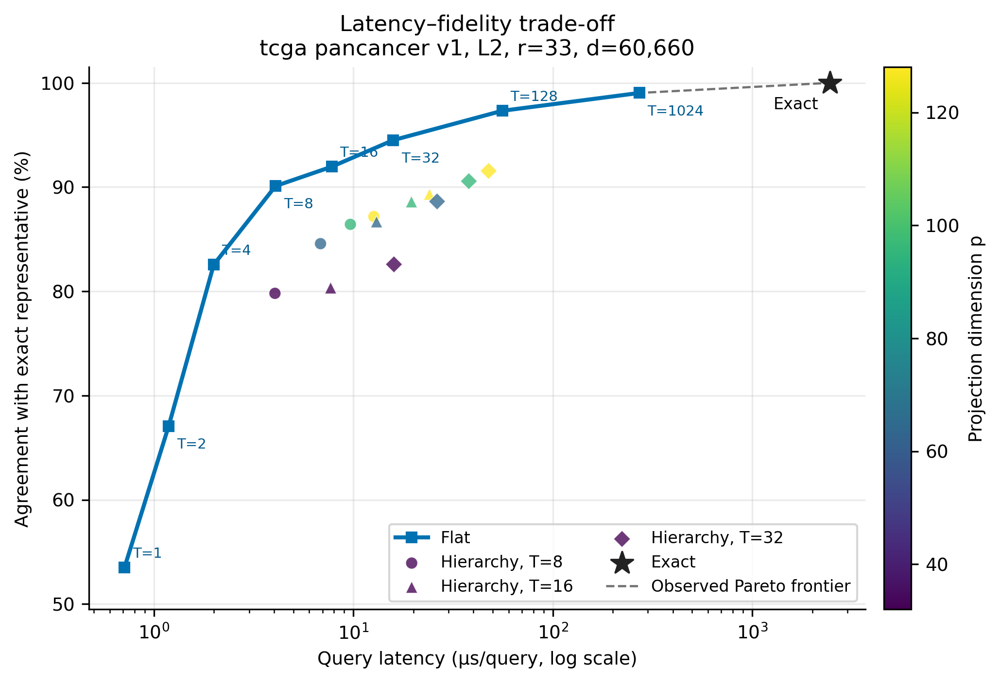
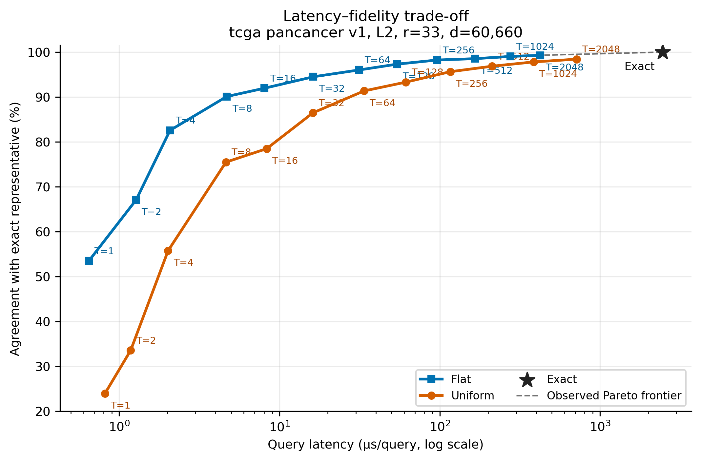
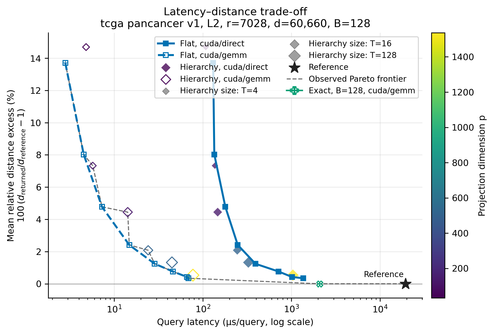

# Ultra-High-Dimensional Nearest-Neighbor Search

[](https://github.com/martingherold/ultrahigh_ann/actions/workflows/ci.yml)

This repository implements and benchmarks approximate nearest-neighbor indexes
for a fixed set of representatives. It targets the regime $d \gg r$, where $d$
is the ambient dimension and $r$ is the number of representatives. Approximate
queries access only selected coordinates before assigning the query to a
representative under $\ell_1$ or $\ell_2$ distance. This is a research
implementation for that specialized regime, not a general replacement for
large-scale ANN libraries.

The algorithms implemented here originate in joint work by
Martin G. Herold, Danupon Nanongkai, Joachim Spoerhase, Nithin Varma, and
Zihang Wu, published at
[HNSVW SoCG 2025](https://doi.org/10.4230/LIPIcs.SoCG.2025.56). A copy is stored in
[literature/ANN.pdf](literature/ANN.pdf) under the publication's
[CC BY 4.0 license](https://creativecommons.org/licenses/by/4.0/).

## Algorithmic overview

The implementation follows the paper's two-stage construction. Importance
sampling first draws a multiset of coordinates from probabilities determined by
the representatives. For the implementation's repetition parameter $T$, the
expected sampled multiplicity is $T S(C)$, where $S(C)$ is the sampling mass;
the theoretical analysis proves $S(C) \le r$. The flat index compares every
representative in this weighted sampled-coordinate space.

The hierarchical index adds a projection to $p$ dimensions before its final
representative scan: a Rademacher Johnson–Lindenstrauss transform for $\ell_2$
and a Cauchy transform for $\ell_1$. The theoretical construction uses
$p=O(\log r)$ when accuracy and failure-probability factors are suppressed.
The experiments expose $T$ and $p$ directly: increasing either generally trades
time and space for fidelity, but the constants determine whether the extra
projection is useful on a finite instance.

## Results

The results below compare implementations within this repository; they are not
claims against a state-of-the-art external ANN library. Reported speedups use
the corresponding exact implementation as the baseline.

### Single-threaded CPU: 33 representatives

On the TCGA Pan-Cancer $\ell_2$ benchmark with 33 representatives, 60,660
dimensions, and 3,013 held-out queries, flat importance sampling defines the
strongest observed latency–fidelity trade-off. Approximate results are
arithmetic means over five sampling seeds; exact search was run once. At $T=8$,
flat search agrees with exact search on 90.1% of queries, is approximately
600 times faster, and accesses 0.14% of coordinates. At $T=32$, agreement rises
to 94.5%; 0.20% of queries have a returned distance more than 10% above the
exact distance, while search remains approximately 155 times faster. At
$T=128$, agreement reaches 97.3%, no such 10%-error cases were observed, and
search remains approximately 44 times faster while accessing 2.01% of
coordinates.

None of the tested hierarchical configurations enters the observed CPU Pareto
frontier at $r=33$. With so few representatives, the reduced final comparison
dimension does not repay the additional projection work. This finite-instance
result does not contradict the projection's asymptotic role.

The resulting latency–fidelity trade-off is shown below. Its configurations are
defined by the [TCGA Pan-Cancer r=33 L2 CPU sparse sweep](experiments/tcga_pancancer/cpu/tcga_pancancer_r33_l2_cpu_sparse_sweep.tsv).



The underlying measurements are available in the
[machine-readable r=33 CPU sparse-sweep report](assets/tcga_pancancer_r33_l2_cpu_sparse_sweep.json).

As a baseline, we also evaluate
[uniform coordinate sampling at r=33](experiments/tcga_pancancer/cpu/tcga_pancancer_r33_l2_cpu_uniform_vs_flat.tsv)
with the same expected sampled multiplicity $T S(C)$. Uniform sampling has
lower agreement at every tested budget. Its latency is comparable at small and
moderate $T$, but becomes higher at large $T$, where it touches substantially
more distinct coordinates.



The underlying measurements are available in the
[machine-readable r=33 CPU uniform-versus-flat report](assets/tcga_pancancer_r33_l2_cpu_uniform_vs_flat.json).

### CUDA: 7,028 representatives

The intended benefit of the hierarchy becomes more plausible as $r$ grows, but
the direct construction of the importance probabilities costs
$O(r^2 d)$. The CUDA implementation makes both this preprocessing and the
larger query workload practical. The large-pool experiment uses all 7,028 TCGA
training samples as representatives, the same 60,660 dimensions, and all 3,013
held-out queries. It fixes the batch size at 128 and compares direct CUDA
reduction kernels with cuBLAS SGEMM for both flat and hierarchical indexes.

With direct kernels, hierarchy improves the observed low- and medium-fidelity
frontier. For example, hierarchical $(T,p)=(16,128)$ takes 147 microseconds per
query with 4.45% mean relative distance excess, compared with 180 microseconds
and 4.77% for flat $T=4$. At $(16,512)$ it takes 245 microseconds with 2.08%
mean excess, compared with 248 microseconds and 2.41% for flat $T=8$. The trend
reverses at higher fidelity: hierarchical $(128,1536)$ takes 1.039 milliseconds
per query and flat $T=48$ takes 1.018 milliseconds, while flat also has the
lower mean excess, 0.424% versus 0.536%.

The result is strategy-dependent. SGEMM makes flat scans much cheaper, and the
hierarchy does not show the same clear advantage. At the high-fidelity
crossover above, flat $T=48$ takes 66.4 microseconds per query with 0.424% mean
excess, while hierarchical $(128,1536)$ takes 77.5 microseconds with 0.536%.
The direct CUDA exact scan is the FP32 reference. The unrefined SGEMM exact scan
selects a different representative for 7 of 3,013 queries, although its maximum
distance excess is below 0.008%.



The configurations are defined by the
[r=7,028 CUDA crossover setup](experiments/tcga_pancancer/cuda/tcga_pancancer_r7028_l2_cuda_crossover.tsv),
and the measurements are available in the
[machine-readable CUDA crossover report](assets/tcga_pancancer_r7028_l2_cuda_crossover.json).
All approximate configurations use the single fixed sampling seed 42, one
warmup, and three timed trials. The figure therefore demonstrates a
reproducible crossover on this instance; it does not estimate variation across
sampling seeds. The two exact configurations use one timed trial each.

### System specifications and timing scope

These results were produced on a notebook with an Intel Core i7-9750H CPU
(6 cores, 12 threads, 2.60 GHz base frequency) and 32 GB of RAM, running Debian
GNU/Linux 12 (bookworm) on x86-64. The benchmarks were compiled in Release mode
with GCC 12.2.0 and CMake 3.29.3. The CPU experiment used the sequential query
strategy. The CUDA experiment used an NVIDIA Quadro T1000, CUDA 13.3, and code
compiled for compute capability 7.5.

Query latency includes coordinate gathering and, for CUDA runs, host-to-device
query transfer, projection, representative scan, and result transfer as
applicable. It excludes dataset loading, probability construction or loading,
index construction, warmups, and full-dimensional diagnostic evaluation. Those
costs are recorded separately in the machine-readable reports. Timings describe
this implementation on this notebook and should not be interpreted as
hardware-independent performance. Each report also records its source commit,
dirty-tree state, build configuration, host and CUDA environment, and SHA-256
identities for its setup and loaded artifacts.

## Quickstart

The CPU quickstart requires CMake 3.20 or newer, a C++20 compiler with its
OpenMP C++ runtime, and Python 3. GCC 12.2 and Clang 14 have been tested. From
the repository root:

```sh
python3 -m pip install -r requirements-figures.txt
cmake -S . -B build \
    -DCMAKE_BUILD_TYPE=Release \
    -DULTRAHIGH_ANN_BUILD_TESTS=ON
cmake --build build --parallel
ctest --test-dir build --output-on-failure
python3 -m unittest discover -s tests/scripts -p 'test_*.py'
python3 scripts/benchmark/run_synthetic_quickstart.py --figures
```

The final command generates a deterministic dataset with 64 representatives
and 512 queries in 16,384 dimensions, runs a compact L2 sweep, and creates a
latency/fidelity plot. It compares exact search with flat importance sampling,
mass-matched uniform sampling, and a small hierarchical grid. This is an
illustrative smoke benchmark, not evidence for the paper or real-data claims;
its generated data, report, and figures remain ignored by Git.

The default build produces `nearest_representative_benchmark`, the L1 and L2
probability tools, and explicit unavailable-backend stubs for the optional CUDA
interfaces. No dataset is required to build or test the project.

## Reproducing the checked-in results

The commands in this section prepare the TCGA data, reproduce the benchmark
reports behind the figures above, and regenerate those figures. Run them from
the repository root.

### Expected runtime

Excluding compilation and one-time data preparation, indicative complete setup
times on the documented system are:

- a few seconds for the synthetic quickstart;
- approximately 20 seconds for the TCGA r=33 CPU sparse sweep;
- approximately 50 seconds for the TCGA r=33 CPU uniform-versus-flat setup;
- approximately 8 minutes for the TCGA r=7,028 CUDA crossover once its
  probability file exists.

These are wall-clock times for complete setups, not the per-query latencies in
the figures, and they remain hardware-dependent. Initial TCGA preparation
requires approximately 2.8 GiB of downloads plus processed storage. On the
documented Quadro T1000, constructing the required 7,028-representative
`gpu_fp32` probability file takes approximately five minutes. Once the
transformed dataset exists, budget roughly 15 minutes for that preprocessing
step and the eight-minute crossover benchmark together.

### CUDA build

CUDA support requires a toolkit containing NVCC, cuBLAS, and the CUDA runtime
development files. CUDA 13.3 has been tested. Keep CUDA objects in a separate
build directory; the architecture below targets the Quadro T1000 used for the
checked-in results, so replace `75` with the target GPU's compute capability.

```sh
cmake -S . -B build-cuda \
    -DCMAKE_BUILD_TYPE=Release \
    -DULTRAHIGH_ANN_BUILD_TESTS=ON \
    -DULTRAHIGH_ANN_ENABLE_CUDA=ON \
    -DCMAKE_CUDA_ARCHITECTURES=75
cmake --build build-cuda --parallel
ctest --test-dir build-cuda --output-on-failure
```

Set `CUDACXX=/path/to/nvcc` on the configure command if CMake cannot find the
intended compiler. An NVIDIA device and compatible driver are required to run
CUDA backends, but not to compile them. In a CUDA-enabled build without a
usable device, CTest reports the eight device-dependent tests as skipped rather
than implying that kernel numerics ran. CPU-only builds still test the explicit
unavailable-backend stubs. For a release gate on a GPU host, add
`-DULTRAHIGH_ANN_REQUIRE_CUDA_DEVICE_TESTS=ON` when configuring, then run:

```sh
ctest --test-dir build-cuda -L cuda-device --output-on-failure
```

That strict option turns an unavailable device into a test failure, so a green
result proves that all eight device-backed tests actually executed.

The main build controls are:

| CMake option | Default | Purpose |
| --- | --- | --- |
| `BUILD_TESTING` | `ON` at the project root | Supplies the top-level default for this project's tests. |
| `ULTRAHIGH_ANN_ENABLE_CUDA` | `OFF` | Compile CUDA backends instead of their stubs. |
| `ULTRAHIGH_ANN_BUILD_BENCHMARKS` | `ON` at the project root | Build the benchmark; defaults to `OFF` as a subproject. |
| `ULTRAHIGH_ANN_BUILD_TOOLS` | `ON` at the project root | Build the L1 and L2 probability tools; defaults to `OFF` as a subproject. |
| `ULTRAHIGH_ANN_BUILD_TESTS` | follows `BUILD_TESTING` at the project root | Build this project's CTest targets; defaults to `OFF` as a subproject. |
| `ULTRAHIGH_ANN_REQUIRE_CUDA_DEVICE_TESTS` | `OFF` | Fail rather than skip device tests when CUDA has no usable GPU; intended for local release validation. |

### Prepare the TCGA data

Download and transform the 33 TCGA Pan-Cancer matrices with the documented,
deterministic seed-42 participant split:

```sh
python3 scripts/data/download_tcga_pancancer.py
python3 scripts/data/transform_tcga_pancancer.py \
    --write-representative-pool
```

The transform creates the 33 centroid representatives and held-out queries used
by the CPU experiments. `--write-representative-pool` also materializes the
7,028 individual training representatives required by the large CUDA setup;
that optional pool consumes roughly 1.6 GiB.

### Precompute the large-pool probabilities

The large CUDA setup loads one reusable L2 probability file. Generate it in
FP32 on CUDA device zero:

```sh
./build-cuda/compute_l2_probabilities \
    --input data/processed/tcga_pancancer_v1/representative_pool.npy \
    --output data/processed/tcga_pancancer_v1/l2_probabilities_7028_gpu_fp32.uap \
    --policy gpu_fp32 \
    --device 0 \
    --gpu-pair-chunks 128
```

The tool reports load, hash, compute, write, and total time separately. Its UAP
version-two output records the metric, matrix shape, and SHA-256 of the exact
representative matrix. The benchmark recomputes and verifies that binding before
reuse, so a stale probability file from a different same-shaped matrix is
rejected. CPU reference policies and the alternative L2 cuBLAS policy are
useful for numerical or implementation studies but are not required to
reproduce the checked-in artifact; see the
[full benchmark and probability-tool contract](experiments/README.md) or either
probability tool's `--help` output.

### Public benchmark setups

The public catalog is deliberately limited to six setups:

1. [Synthetic L2 quickstart](experiments/synthetic/synthetic_quickstart_l2.tsv)
   is a deterministic smoke test without external data.
2. [TCGA r=33 L2 CPU sparse sweep](experiments/tcga_pancancer/cpu/tcga_pancancer_r33_l2_cpu_sparse_sweep.tsv)
   produces the headline CPU trade-off.
3. [TCGA r=33 L2 uniform versus flat](experiments/tcga_pancancer/cpu/tcga_pancancer_r33_l2_cpu_uniform_vs_flat.tsv)
   provides the matched sampling baseline.
4. [TCGA r=33 L1 CUDA exact versus flat](experiments/tcga_pancancer/cuda/tcga_pancancer_r33_l1_cuda_exact_vs_flat.tsv)
   covers the L1 metric and its CUDA path.
5. [TCGA r=7,028 L2 CUDA crossover](experiments/tcga_pancancer/cuda/tcga_pancancer_r7028_l2_cuda_crossover.tsv)
   produces the large-pool result discussed above.
6. [TCGA r=33 L2 CUDA numerical validation](experiments/tcga_pancancer/cuda/tcga_pancancer_r33_l2_cuda_numerical_validation.tsv)
   audits direct and unrefined-GEMM selections against a CPU reference.

Each version-two TSV setup names its dataset, exact reference, outputs, and
runs. The executable loads the dataset once, evaluates the reference first,
and emits a canonical schema-version 5 JSON report plus trial-level CSV. It
rejects older report layouts. The JSON provenance block binds the result to its
source commit, build and execution environment, setup, dataset matrices, and
optional probability file. Large-pool setups use `selected_distances`
diagnostics; `full_distance_table` additionally supports ranks and margins at
the cost of evaluating every query/representative pair. The
[experiment documentation](experiments/README.md) contains the complete setup
grammar, backend support matrix, report contract, and plotting options.

### Run and plot

Run the two CPU setups behind the checked-in CPU figures:

```sh
./build/nearest_representative_benchmark \
    --setup experiments/tcga_pancancer/cpu/tcga_pancancer_r33_l2_cpu_sparse_sweep.tsv
./build/nearest_representative_benchmark \
    --setup experiments/tcga_pancancer/cpu/tcga_pancancer_r33_l2_cpu_uniform_vs_flat.tsv
```

Run the large-pool CUDA crossover after creating its probability file:

```sh
./build-cuda/nearest_representative_benchmark \
    --setup experiments/tcga_pancancer/cuda/tcga_pancancer_r7028_l2_cuda_crossover.tsv
```

Append `--validate-only` to any benchmark command to validate its setup without
loading data or accessing CUDA. Reports are written below `results/raw/`.
Regenerate the three displayed figures with:

```sh
python3 scripts/reporting/create_benchmark_figures.py \
    --report results/raw/tcga_pancancer_r33_l2_cpu_sparse_sweep.json \
    --figures pareto
python3 scripts/reporting/create_benchmark_figures.py \
    --report results/raw/tcga_pancancer_r33_l2_cpu_uniform_vs_flat.json \
    --figures pareto
python3 scripts/reporting/create_benchmark_figures.py \
    --report results/raw/tcga_pancancer_r7028_l2_cuda_crossover.json \
    --batch-size 128 \
    --figures distance \
    --distance-statistic mean \
    --compact
```

Generated plots are written below `results/plots/`. The distance figure reports
relative distance excess as
`100 * (returned_distance / reference_distance - 1)`.

## Library integration

Install the library, public headers, and CMake package into a chosen prefix:

```sh
cmake --install build --prefix /path/to/prefix
```

CMake consumers can then use `find_package(ultrahigh_ann CONFIG REQUIRED)` and
link `ultrahigh_ann::ultrahigh_ann`. Public headers use the project prefix, for
example `#include <ultrahigh_ann/exact/l2/exact_l2_index.hpp>`.

## Repository layout

```text
include/ultrahigh_ann/  Public C++ headers
src/                    C++ implementations and command-line programs
tests/                  C++ and Python tests
scripts/                Dataset, benchmark, and reporting utilities
experiments/            Public setup files and their detailed contract
data/                   Local data plus reproducible split guidance
results/                Git-ignored benchmark reports and generated plots
assets/                 Tracked reports and figures used in this README
literature/             Supporting papers
```

## License

Copyright (C) 2026 Martin G. Herold.

This project is licensed under the GNU General Public License, version 3 only
(`GPL-3.0-only`). See [LICENSE](LICENSE) for the complete license text.
