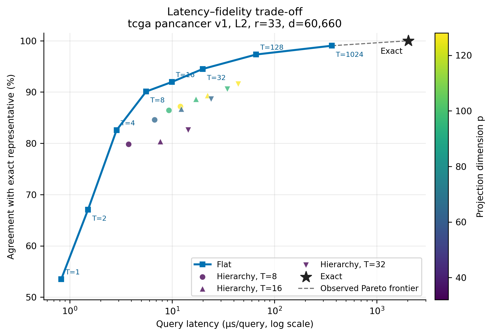
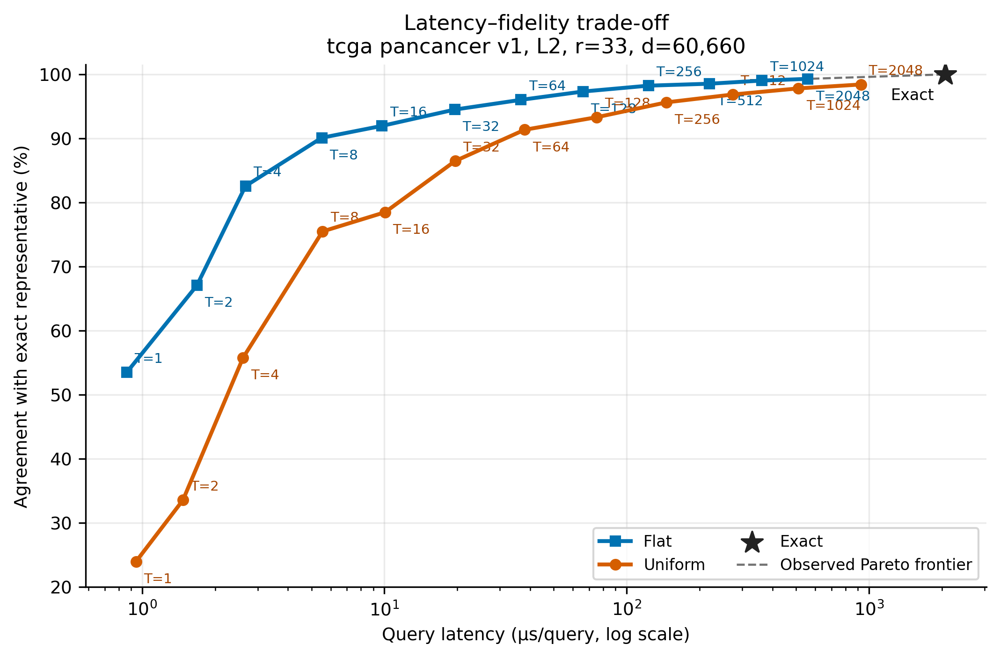

# Ultra-High-Dimensional Nearest-Representative Search

This repository studies when a query can be assigned to one of a small number
of representatives while acquiring only a small fraction of its coordinates.

The project is deliberately scoped to the regime $d \gg r$, where $d$ is
the ambient dimension and $r$ is the number of representatives. It is not
intended as a general replacement for large-scale ANN indexes.

The theoretical results underlying this repository are joint work by
Martin G. Herold, Danupon Nanongkai, Joachim Spoerhase, Nithin Varma, and
Zihang Wu, published at
[HNSVW SoCG 2025](https://doi.org/10.4230/LIPIcs.SoCG.2025.56). A copy is stored in
[literature/ANN.pdf](literature/ANN.pdf).

## Results

The implementation follows the two-stage construction of [HNSVW SoCG 2025](https://doi.org/10.4230/LIPIcs.SoCG.2025.56). Importance sampling first selects a multiset of coordinates with expected multiplicity $T S(C)$, where $S(C)\le r$. The hierarchical variant subsequently applies a Johnson–Lindenstrauss projection, reducing the comparison dimension to $p=O(\log r)$ in the theoretical construction.

On the TCGA Pan-Cancer L2 benchmark with 33 representatives, 60,660 dimensions, and 3,013 held-out queries, flat importance sampling provides the strongest practical trade-off. Approximate-method results are means over five sampling seeds; exact search was run once. At $T=8$, it agrees with exact search on ~90% of queries while providing a ~370× query-time speedup and accessing 0.14% of coordinates. At $T=32$, agreement increases to 94.5%, only 0.20% of queries exceed a 10% distance error, and query search remains ~100x faster than exact. At $T=128$, agreement reaches ~97%, no 10%-approximation failures were observed, and the method remains ~30× faster while accessing 2.01% of coordinates.

At $r=33$, the additional JL projection generally does not improve the high-fidelity latency–agreement trade-off. This does not contradict its theoretical role: JL provides an asymptotic reduction from $O(r)$ to $O(\log r)$, but its finite-instance projection cost is not recovered when the representative set is this small.

Whether hierarchy becomes beneficial for substantially larger representative sets remains an open experimental question.

The resulting latency–fidelity trade-off is shown below. Its configurations are
defined by the [TCGA Pan-Cancer L2 sparse sweep](experiments/tcga_pancancer_l2_sparse_sweep.tsv).



The underlying measurements are available in the
[machine-readable sparse-sweep report](assets/tcga_pancancer_l2_sparse_sweep.json).

As a baseline, we also evaluate
[uniform coordinate sampling](experiments/tcga_pancancer_l2_uniform_vs_flat.tsv)
with the same expected sampled multiplicity $T S(C)$. Uniform sampling has
lower agreement at every tested budget. Its latency is comparable at small and
moderate $T$, but becomes higher at large $T$, where it touches substantially
more distinct coordinates.



The underlying measurements are available in the
[machine-readable uniform-versus-flat report](assets/tcga_pancancer_l2_uniform_vs_flat.json).

## Reproducibility

Follow the commands below to build the project, prepare the data, run the
experiments, and regenerate the figures.

Full TCGA Pan-Cancer reproduction requires approximately 2.8 GiB of downloads, additional processed storage, and substantially more execution time. The synthetic quickstart provides a deterministic smoke test that runs in seconds without external data.

## Repository layout

```text
include/       Public C++ headers
src/           C++ implementations and benchmark executable
tests/         Unit and property tests
scripts/       Dataset preparation and experiment orchestration
data/          Local datasets, generated instances, and tracked split definitions
results/       Local, Git-ignored benchmark reports and generated plots
assets/        Tracked reports and figures used in this README
literature/    Supporting papers
```

## Build

Configure, build, and test it with:

```sh
cmake -S . -B build
cmake --build build
ctest --test-dir build
```

## Synthetic quickstart

Generate a deterministic high-dimensional dataset and run a compact L2 sweep
without downloading external data:

```sh
python3 -m pip install -r requirements-figures.txt
python3 scripts/run_synthetic_quickstart.py
```

The generated dataset contains 64 representatives and 512 controlled-margin
queries in 16,384 dimensions, with representative variation concentrated in
2,048 coordinates. The setup compares exact search with flat importance
sampling, mass-matched uniform sampling, and a small hierarchical grid. It is
an illustrative smoke benchmark, not experimental evidence for the theoretical
or real-data claims. Generated matrices and reports remain ignored by Git.
Pass `--figures` to also create the latency/fidelity Pareto plot.

## TCGA representative-query benchmark

Download and prepare the TCGA matrices, build the C++ targets, and run the exact, flat, and
hierarchical L1 or L2 indexes:

```sh
python3 scripts/download_tcga.py
python3 scripts/transform_tcga.py
cmake -S . -B build -DCMAKE_BUILD_TYPE=Release
cmake --build build --parallel
./build/nearest_representative_benchmark \
    --distance l1 \
    --output results/raw/tcga_l1_benchmark.json
./build/nearest_representative_benchmark \
    --distance l2 \
    --output results/raw/tcga_l2_benchmark.json
```

The executable loads `representatives.npy`, `queries.npy`, and
`query_labels.npy` from `data/processed/tcga_kidney_v1/`. It runs exact search,
then the flat sampled index, then the hierarchical sampled/projection index.
L1 uses a Cauchy projection and L2 uses a Rademacher
Johnson-Lindenstrauss projection. The executable reports construction time,
total and per-query time, classification accuracy,
agreement with exact search, logical index space, reusable query-workspace
space, and coordinate acquisition. It also writes the same results, dataset
dimensions, input paths, seed, query limit, repetitions, projection dimension,
unique-coordinate count, and sampled multiplicity to
`results/raw/tcga_l1_benchmark.json` or
`results/raw/tcga_l2_benchmark.json`.

The space measurement is the standalone logical payload retained by each index
after construction. It excludes allocator metadata and C++ object bookkeeping.
For exact search it includes the borrowed full representative matrix; for the
sampled indexes it includes only their owned compressed structures.

The sampling defaults are illustrative rather than tuned. Inspect all runtime
options with:

```sh
./build/nearest_representative_benchmark --help
```

Select a different report location with `--output`:

```sh
./build/nearest_representative_benchmark \
    --distance l1 \
    --repetitions 64 \
    --projection-dimension 255 \
    --seed 42 \
    --output results/raw/tcga_r64_p255_seed42.json
```

For the 33-representative TCGA Pan-Cancer experiment, first download and
transform the project matrices, then point the same benchmark at the generated
directory:

```sh
python3 scripts/download_tcga_pancancer.py
python3 scripts/transform_tcga_pancancer.py
./build/nearest_representative_benchmark \
    --distance l1 \
    --dataset data/processed/tcga_pancancer_v1 \
    --output results/raw/tcga_pancancer_l1_benchmark.json

./build/nearest_representative_benchmark \
    --distance l2 \
    --dataset data/processed/tcga_pancancer_v1 \
    --output results/raw/tcga_pancancer_l2_benchmark.json
```

## Multi-configuration benchmark setups

Use a versioned setup file when comparing several approximate configurations.
The C++ process loads the dataset once and executes exact search once, then
reuses those exact predictions for every named approximate run:

```sh
./build/nearest_representative_benchmark \
    --setup experiments/tcga_pancancer_l1_flat_sweep.tsv

./build/nearest_representative_benchmark \
    --setup experiments/tcga_pancancer_l2_flat_sweep.tsv
```

The included Pan-Cancer flat setups evaluate sampling budgets
`64, 128, 256, 512, 1024` over five seeds, without constructing or querying the
hierarchical index. Each writes one schema-version 4 JSON report containing the
single exact result and all 25 flat results. The setup syntax and supported
method parameters are documented in
[experiments/README.md](experiments/README.md).

The generic sweep runner starts the same single C++ process and additionally
writes per-run and aggregate CSV/JSON summaries beside the raw report:

```sh
python3 scripts/run_benchmark_sweep.py \
    --setup experiments/tcga_pancancer_l1_flat_sweep.tsv

python3 scripts/run_benchmark_sweep.py \
    --setup experiments/tcga_pancancer_l2_flat_sweep.tsv
```

It reuses an existing matching combined report by default; pass `--force` to
repeat the measurements. Every configured method is summarized. When a setup
contains hierarchy, its matched hierarchy-versus-flat summaries retain the
standard filenames, while complete flat and uniform summaries receive `_flat`
and `_uniform` filename suffixes.

Reproduce the latency/fidelity figures shown in the Results section with:

```sh
python3 scripts/run_benchmark_sweep.py \
    --setup experiments/tcga_pancancer_l2_sparse_sweep.tsv
python3 scripts/run_benchmark_sweep.py \
    --setup experiments/tcga_pancancer_l2_uniform_vs_flat.tsv
python3 -m pip install -r requirements-figures.txt
python3 scripts/create_benchmark_figures.py \
    --report results/raw/tcga_pancancer_l2_sparse_sweep.json \
    --figures pareto
python3 scripts/create_benchmark_figures.py \
    --report results/raw/tcga_pancancer_l2_uniform_vs_flat.json \
    --figures pareto
```

See [experiments/README.md](experiments/README.md#publication-figures) for the
output files and hierarchy-filtering options.

## License

Copyright (C) 2026 Martin G. Herold.

This project is licensed under the GNU General Public License, version 3 only
(`GPL-3.0-only`). See [LICENSE](LICENSE) for the complete license text.
